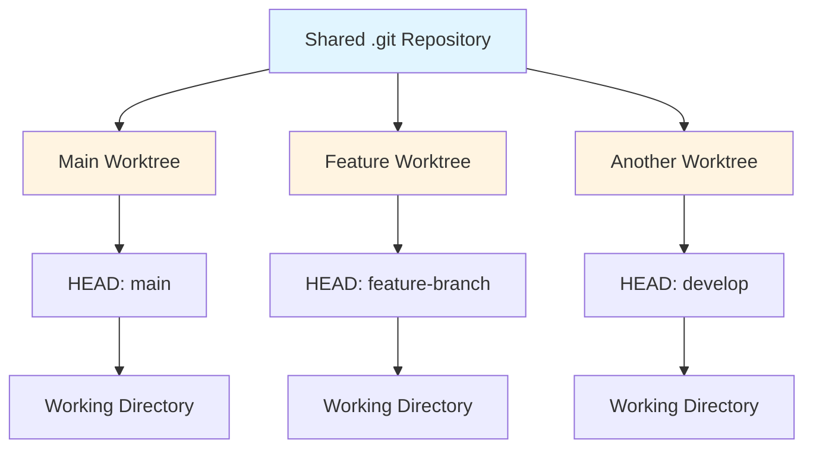

# Git Worktree Branch Visibility: Technical Explanation

## Overview

When working with Git worktrees, users often encounter confusion about branch visibility—specifically why the `main` branch (or other branches) may appear "hidden" when viewing branches from within a worktree. This document explains the technical reasons behind this behavior and provides practical solutions.

---

## 1. Technical Reasons Why Main Branch Appears Hidden

### 1.1 Worktree-Specific HEAD Pointer

Each worktree has its own independent `HEAD` pointer that references a specific branch or commit. When you run `git branch` within a worktree, Git only displays branches that are **currently checked out** in any worktree or are **local branches** that haven't been explicitly excluded.

The key technical reasons include:

1. **Separate Working Directories, Shared Repository**
   - All worktrees share the same `.git` directory (the repository database)
   - Each worktree has its own working directory and `.git` file pointing to the shared repo
   - The `HEAD` file in each worktree is independent

2. **Branch Checkout Locking**
   - Git prevents the same branch from being checked out in multiple worktrees simultaneously
   - If `main` is checked out in the main repository, it cannot be checked out in a worktree
   - This creates the illusion that `main` is "hidden" in the worktree

3. **Detached HEAD State**
   - If a worktree was created without specifying a branch (using a commit hash), it's in a detached HEAD state
   - In detached HEAD state, `git branch` shows all branches, but the worktree isn't on any of them

### 1.2 Branch Filtering Behavior

Git's branch listing behavior varies based on context:

```bash
# In main repository (with main checked out)
git branch
# Shows: * main, feature-1, feature-2

# In worktree (with feature-1 checked out)
git branch
# Shows: main, * feature-1, feature-2
```

The asterisk (*) indicates which branch is currently checked out in **that specific worktree**.

---

## 2. Branch Visibility: Worktree vs Main Repository

### 2.1 Shared Repository, Independent Working States

```
Repository Structure:
┌─────────────────────────────────────┐
│         Shared .git Directory        │
│  (commits, refs, objects, config)   │
└─────────────────────────────────────┘
           │               │
           ▼               ▼
┌─────────────────┐  ┌─────────────────┐
│  Main Worktree │  │  Feature Worktree│
│  (working dir) │  │  (working dir)  │
│  HEAD → main   │  │  HEAD → feature │
└─────────────────┘  └─────────────────┘
```

### 2.2 Branch Visibility Comparison

| Aspect | Main Repository | Worktree |
|--------|----------------|----------|
| **Branch List** | Shows all local branches | Shows all local branches |
| **Current Branch** | Marked with `*` | Marked with `*` (independent) |
| **Checkout Locking** | Can checkout any branch | Cannot checkout branch already checked out elsewhere |
| **Shared Data** | N/A | Commits, refs, objects, config |
| **Independent Data** | Working directory, index, HEAD | Working directory, index, HEAD |

### 2.3 Visual Representation



---

## 3. Git Commands to Check Current State and Access Main Branch

### 3.1 Check Current Worktree State

```bash
# List all worktrees in the repository
git worktree list

# Output example:
# /path/to/main-repo           1a2b3c4d [main]
# /path/to/feature-worktree    5e6f7g8h [feature-branch]
# /path/to/bugfix-worktree     9i0j1k2l [bugfix-123]
```

### 3.2 Check Current Branch in Worktree

```bash
# Show current branch (works from any worktree)
git rev-parse --abbrev-ref HEAD

# Output: feature-branch (or 'HEAD' if detached)
```

### 3.3 List All Branches

```bash
# List all local branches
git branch

# List all branches (local and remote)
git branch -a

# List branches with last commit info
git branch -v

# List branches in verbose format
git branch -vv
```

### 3.4 Check Which Branches Are Checked Out

```bash
# Show which branches are currently checked out in any worktree
git worktree list --porcelain | grep -A 2 "^worktree"

# More detailed view
git worktree list
```

### 3.5 Access Main Branch from Worktree

#### Option 1: View main branch without checking out
```bash
# View main branch files (without checking out)
git show main:path/to/file.txt

# View main branch commit history
git log main

# View main branch diff
git diff main
```

#### Option 2: Switch to main branch in worktree
```bash
# Only works if main is NOT checked out elsewhere
git checkout main

# If main is checked out in another worktree, you'll get an error:
# fatal: 'main' is already checked out at '/path/to/main-repo'
```

#### Option 3: Create a new branch from main
```bash
# Create and checkout a new branch based on main
git checkout -b my-feature main

# This works even if main is checked out elsewhere
```

### 3.6 Switch Between Worktrees

```bash
# Navigate to different worktree directories
cd /path/to/main-repo
cd /path/to/feature-worktree

# From within any worktree, check status of all worktrees
git worktree list
```

---

## 4. Common Scenarios and Solutions

### Scenario 1: Main Branch Not Visible in Worktree

**Problem**: Running `git branch` in a worktree doesn't show `main`.

**Possible Causes**:
1. `main` is checked out in another worktree (including the main repository)
2. You're in a detached HEAD state
3. The branch was renamed or deleted

**Solutions**:

```bash
# Check if main is checked out elsewhere
git worktree list

# Check if main branch exists
git branch -a | grep main

# If main exists but is checked out elsewhere, create a new branch from it
git checkout -b my-work main

# Or view main without checking out
git log main
git show main
```

### Scenario 2: Want to Work on main Branch in Worktree

**Problem**: Need to work on `main` but it's checked out in the main repository.

**Solutions**:

```bash
# Option 1: Switch main repository to a different branch first
cd /path/to/main-repo
git checkout develop
git worktree add /path/to/new-worktree main

# Option 2: Create a worktree from main (if main is not checked out)
git worktree add /path/to/main-worktree main

# Option 3: Use a temporary branch
git checkout -b temp-main main
# Work on temp-main, then merge back to main later
```

### Scenario 3: Worktree Shows Detached HEAD

**Problem**: Worktree is in detached HEAD state, showing no current branch.

**Check**:
```bash
git rev-parse --abbrev-ref HEAD
# Output: HEAD
```

**Solution**:
```bash
# Checkout a branch
git checkout main
# or
git checkout -b new-branch
```

---

## 5. VSCode Extension Context

Based on the Git Worktree Manager extension code, the extension handles branch visibility through:

1. **`listBranches()` method** (lines 95-106 in [`gitWorktreeManager.ts`](src/gitWorktreeManager.ts:95-106)):
   ```typescript
   async listBranches(): Promise<string[]> {
       const output = await this.executeGitCommand('git branch -a --format="%(refname:short)"');
       return output
           .split('\n')
           .map(b => b.trim().replace(/^"/, '').replace(/"$/, ''))
           .filter(b => b && !b.includes('HEAD'));
   }
   ```
   - This lists ALL branches (local and remote)
   - The command is executed from the current workspace root
   - All worktrees share the same branch list

2. **`switchBranchInWorktree()` method** (lines 159-184):
   - Checks if branch exists locally in the worktree
   - If not, checks remote branches
   - Performs checkout operation in the specific worktree directory

3. **Key Insight**: The extension shows all branches because it queries the shared repository, not just the worktree-specific state.

---

## 6. Best Practices for Worktree Branch Management

### 6.1 Branch Naming Strategy
- Use descriptive branch names: `feature/`, `bugfix/`, `hotfix/`
- Avoid checking out the same branch in multiple worktrees
- Keep main repository on a stable branch (e.g., `main` or `develop`)

### 6.2 Worktree Organization
```
project/
├── .git/                    # Shared repository
├── main/                    # Main worktree (main branch)
├── feature-auth/            # Feature worktree
├── bugfix-login/            # Bugfix worktree
└── hotfix-critical/         # Hotfix worktree
```

### 6.3 Recommended Workflow
```bash
# 1. Keep main repository on main branch
cd project/main
git checkout main

# 2. Create worktree for feature
git worktree add ../feature-auth feature/auth

# 3. Work in feature worktree
cd ../feature-auth
# Make changes, commit

# 4. Merge feature back to main
cd ../main
git merge feature/auth

# 5. Clean up feature worktree
git worktree remove ../feature-auth
```

---

## 7. Summary

### Key Points:

1. **Main branch is not actually hidden**—it's just not checked out in the current worktree
2. **All branches are visible** when using `git branch -a` from any worktree
3. **Branch checkout locking** prevents the same branch from being active in multiple worktrees
4. **Worktrees share the repository** but have independent working directories and HEAD pointers
5. **VSCode extension** shows all branches because it queries the shared repository

### Quick Reference Commands:

| Command | Purpose |
|---------|---------|
| `git worktree list` | List all worktrees and their branches |
| `git branch -a` | Show all branches (local and remote) |
| `git rev-parse --abbrev-ref HEAD` | Show current branch |
| `git checkout main` | Switch to main branch (if not locked) |
| `git show main:path/to/file` | View file from main without checkout |
| `git log main` | View main branch history |

---

## 8. Additional Resources

- [Git Worktree Documentation](https://git-scm.com/docs/git-worktree)
- [Git Branch Documentation](https://git-scm.com/docs/git-branch)
- [VSCode Git Worktree Manager Extension](https://github.com/Shivam-20/gitWorkTreeManger)
