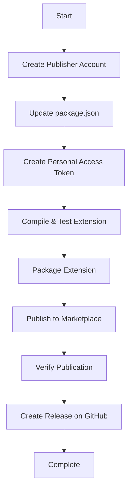

# VS Code Extension Publication Plan

## Overview
This document outlines the complete process for publishing the Git Worktree Manager extension to the public VS Code Marketplace.

## Current State Assessment

### Extension Information
- **Name**: git-worktree-manager
- **Display Name**: Git Worktree Manager
- **Version**: 1.0.0
- **License**: MIT
- **Repository**: https://github.com/Shivam-20/gitWorkTreeManger

### Issues Identified
1. `package.json` publisher field is set to placeholder: `"tryToDEv"`
2. `package.json` repository URL is placeholder: `"https://github.com/your-username/git-worktree-manager"`
3. `package.json` bugs URL is placeholder: `"https://github.com/your-username/git-worktree-manager/issues"`
4. No publisher account exists on Visual Studio Marketplace
5. No Personal Access Token (PAT) configured for publishing

---

## Publication Workflow



---

## Detailed Steps

### Phase 1: Pre-Publication Setup

#### Step 1: Create Publisher Account on Visual Studio Marketplace
1. Go to https://marketplace.visualstudio.com/
2. Sign in with a Microsoft account (create one if needed)
3. Navigate to "Manage Extensions" or "Publish Extensions"
4. Click "Create a publisher"
5. Fill in publisher information:
   - **Publisher ID**: A unique identifier (e.g., `shivam20`, `git-worktree-manager`)
   - **Publisher Name**: Display name (e.g., "Shivam", "Git Worktree Manager Team")
   - **Description**: Brief description of the publisher
   - **Website**: Optional (can link to GitHub profile)
6. Accept the publisher agreement
7. Note down your **Publisher ID** (this will be used in package.json)

#### Step 2: Update package.json
Update the following fields in [`package.json`](../package.json):

```json
{
  "publisher": "YOUR_PUBLISHER_ID",
  "repository": {
    "type": "git",
    "url": "https://github.com/Shivam-20/gitWorkTreeManger"
  },
  "bugs": {
    "url": "https://github.com/Shivam-20/gitWorkTreeManger/issues"
  }
}
```

Replace `YOUR_PUBLISHER_ID` with the publisher ID obtained in Step 1.

#### Step 3: Create Personal Access Token (PAT)
1. Go to https://dev.azure.com/
2. Sign in with the same Microsoft account used for the publisher
3. Click on your profile → User Settings → Personal Access Tokens
4. Click "New Token"
5. Configure the token:
   - **Name**: "VS Code Extension Publishing" (or similar)
   - **Organization**: "All accessible organizations"
   - **Expiration**: Choose an appropriate expiration (e.g., 1 year)
   - **Scopes**: Select "Marketplace" → Check "Manage"
6. Click "Create"
7. **Important**: Copy and save the token securely (you won't see it again)

---

### Phase 2: Preparation

#### Step 4: Verify Dependencies
Ensure all dependencies are installed:
```bash
npm install
```

#### Step 5: Compile the Extension
Compile TypeScript to JavaScript:
```bash
npm run compile
```

#### Step 6: Run Tests (Optional but Recommended)
If tests exist:
```bash
npm test
```

#### Step 7: Lint the Code (Optional but Recommended)
Check for code quality issues:
```bash
npm run lint
```

---

### Phase 3: Packaging

#### Step 8: Package the Extension
Create a `.vsix` package file:
```bash
npm run package
```

This will create a file named `git-worktree-manager-1.0.0.vsix` in the project root.

#### Step 9: Verify the Package
Check that the `.vsix` file was created successfully and contains all necessary files.

---

### Phase 4: Publishing

#### Step 10: Publish to Marketplace
Option A: Using vsce CLI (Recommended)
```bash
npx vsce publish
```

When prompted, enter the Personal Access Token created in Step 3.

Option B: Using npm script (if added to package.json)
```bash
npm run publish
```

#### Step 11: Verify Publication
1. Go to https://marketplace.visualstudio.com/
2. Search for "Git Worktree Manager"
3. Verify the extension appears with correct information
4. Check the extension page for:
   - Correct display name
   - Description
   - Version
   - Publisher name
   - Repository link
   - License information

---

### Phase 5: Post-Publication

#### Step 12: Create GitHub Release
1. Go to your repository: https://github.com/Shivam-20/gitWorkTreeManger/releases
2. Click "Create a new release"
3. Tag version: `v1.0.0`
4. Release title: "v1.0.0 - Initial Release"
5. Description: Include release notes from README.md
6. Attach the `.vsix` file to the release
7. Click "Publish release"

#### Step 13: Update README.md (Optional)
Update the installation section to include the marketplace installation method:
```markdown
### From VS Code Marketplace

1. Open VS Code
2. Go to Extensions (Ctrl+Shift+X)
3. Search for "Git Worktree Manager"
4. Click "Install"
```

#### Step 14: Test Installation
1. Open VS Code
2. Go to Extensions
3. Search for "Git Worktree Manager"
4. Install and verify it works correctly

---

## Troubleshooting

### Common Issues

#### Issue: "Publisher not found"
- **Cause**: Publisher ID in package.json doesn't match the actual publisher ID
- **Solution**: Verify publisher ID on marketplace and update package.json

#### Issue: "Authentication failed"
- **Cause**: Invalid or expired Personal Access Token
- **Solution**: Create a new PAT with correct scopes

#### Issue: "Version already exists"
- **Cause**: Trying to publish a version that's already published
- **Solution**: Increment version number in package.json

#### Issue: "Missing icon"
- **Cause**: Icon file not found or incorrect path
- **Solution**: Verify icon.png exists in resources/ directory

---

## Future Maintenance

### Updating the Extension
1. Make code changes
2. Update version in package.json (follow semantic versioning)
3. Update CHANGELOG.md with new features/fixes
4. Compile: `npm run compile`
5. Publish: `npx vsce publish`
6. Create GitHub release

### Versioning Guidelines
- **Major version (X.0.0)**: Breaking changes
- **Minor version (1.X.0)**: New features (backwards compatible)
- **Patch version (1.0.X)**: Bug fixes (backwards compatible)

---

## Additional Resources

- [VS Code Extension API](https://code.visualstudio.com/api)
- [Publishing Extensions](https://code.visualstudio.com/api/working-with-extensions/publishing-extension)
- [vsce CLI Documentation](https://github.com/microsoft/vscode-vsce)
- [Visual Studio Marketplace](https://marketplace.visualstudio.com/)

---

## Summary Checklist

- [ ] Create publisher account on Visual Studio Marketplace
- [ ] Update package.json with correct publisher ID and repository URLs
- [ ] Create Personal Access Token with Marketplace: Manage scope
- [ ] Install dependencies: `npm install`
- [ ] Compile extension: `npm run compile`
- [ ] (Optional) Run tests: `npm test`
- [ ] (Optional) Run linter: `npm run lint`
- [ ] Package extension: `npm run package`
- [ ] Publish extension: `npx vsce publish`
- [ ] Verify publication on marketplace
- [ ] Create GitHub release with .vsix file
- [ ] Test installation from marketplace
